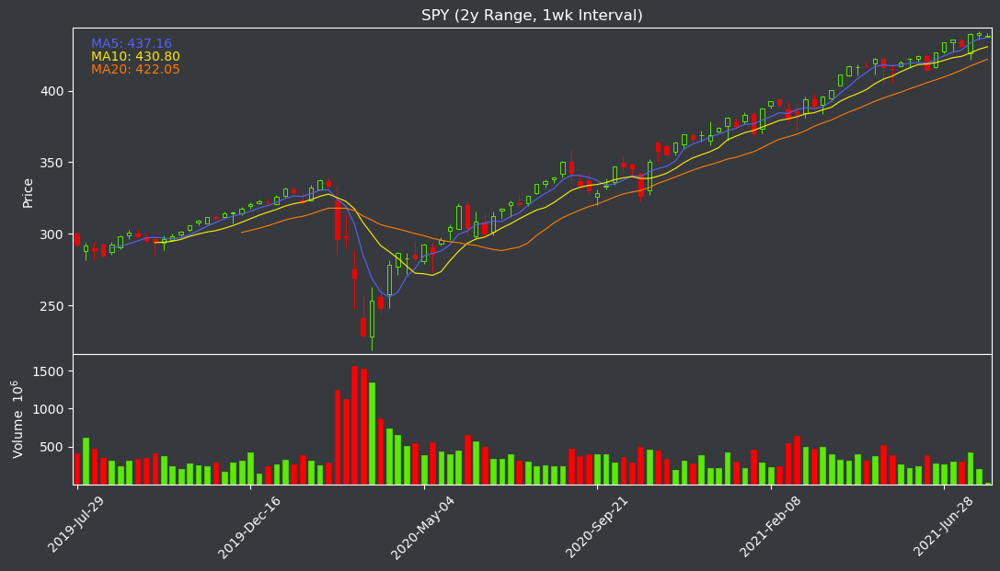

# Discord Dark Theme Compatible Stock Chart

## Description
Stock price plotter that matches Discord's dark theme made with matplotlib, mplfinance, pandas, and requests in Python. Can be included in discord.py bots with slight changes.

## Setup
`pip install matplotlib mplfinance pandas request`

## Example

## Issues
* Yahoo Finance returns an Error 404 for certain requests e.g. when range = 1d and interval = 5m

## Version
* Python 3.8.0